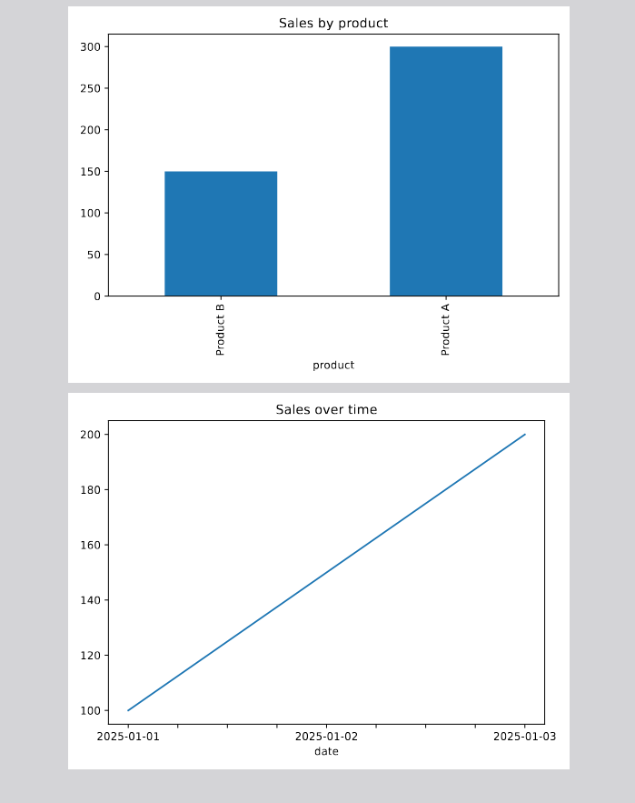

# CSV Analysis & Report

Example script that loads a CSV file (e.g. `sales.csv`), cleans the data, and generates a PDF report with charts.

Files:
- `analyze.py` - main script
- `sales_example.csv` - example data

## Installation
1. Install dependencies:

pip install -r requirements.txt

## Usage

python3 analyze.py sales_example.csv report.pdf

